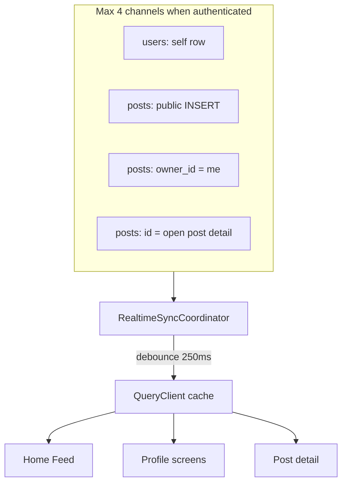

# App-Wide Realtime Sync — Design Spec

> **Status:** Approved (2026-05-24) — IG/FB-style feed merge + coordinator; performance guardrails in §7  
> **Date:** 2026-05-24  
> **Mapped FRs:** FR-FEED-009 (amendment), FR-PROFILE-013 AC5, FR-STATS-001 AC2 (phase 3), FR-FOLLOW-* counter freshness (phase 3)  
> **Closes / mitigates:** TD-105 (profile counters), TD-98 (stats reactive), TD-126 (partial — memo + cache hygiene in implementation plan)

---

## 1. Problem

Most screens load data once via TanStack Query and only refresh on manual pull-to-refresh, navigation, or local `invalidateQueries` after the user's own action. Chat already uses Supabase Realtime end-to-end and feels live. **Home Feed** and **Profile** (primary pain) and other surfaces feel stale when data changes on the server (another device, another user, closure, counter updates).

**PM decisions (2026-05-24):**

- Scope: app should feel **live everywhere**; **priority** = Home Feed + Profile (my + other).
- Chat: **no change** (already good).
- Feed new posts: **auto-prepend to top** (option B) — **not** the "↑ N new posts" tap-to-refresh banner.
- **Hard constraint:** must not make the app noticeably slow (battery, scroll jank, network storms).

---

## 2. Recommended approach — Hybrid Realtime Coordinator (approach C)

A single **app-level coordinator** (composition root / `AuthGate` lifecycle) owns a **small, fixed set** of Supabase Realtime channels. Events are **debounced** and applied via **targeted cache updates** (TanStack Query `setQueryData` / narrow `invalidateQueries`) — not full-app refetches.

**Clean architecture:**

| Layer | Artifact |
|-------|----------|
| `packages/application` | Ports: extend `IFeedRealtime` → `IPostRealtime` (or unified `IAppRealtime`) with typed callbacks; no Supabase imports |
| `packages/infrastructure-supabase` | `SupabasePostRealtime`, `SupabaseUserRealtime` adapters |
| `apps/mobile` | `RealtimeSyncCoordinator`, `useRealtimeSync`, feed/profile cache helpers |

---

## 3. Database prerequisites

Migration adds tables to `supabase_realtime` publication (idempotent, same pattern as `0004` / `0007`):

| Table | Events | Why |
|-------|--------|-----|
| `public.posts` | INSERT, UPDATE, DELETE | Feed freshness, profile grids, post detail |
| `public.users` | UPDATE | Already in `0007` — verify enabled on dev/prod |
| Phase 3: `follow_requests`, `notifications` | INSERT, UPDATE | Follow requests, in-app notification list |

RLS remains the authority: clients only receive rows they can `SELECT`. No broad `*` subscriptions without filters where possible.

**Filter strategy:**

- **Self user:** `users` channel `id=eq.<viewerId>` (single row, tiny payload).
- **Own posts:** `posts` channel `owner_id=eq.<viewerId>` for profile grids / closed tab moves.
- **Public feed inserts:** `posts` INSERT `visibility=eq.Public` (reuse current feed filter; extend for UPDATE/DELETE without filter on event — handler checks cache membership).
- **Post detail:** ephemeral channel `post_id=eq.<id>` only while `/post/[id]` is mounted.

---

## 4. Feed behavior (FR-FEED-009 amendment)

### 4.1 Spec change

**FR-FEED-009 AC2** — replace banner-only UX with:

- AC2 (new): When the Home Feed tab is **focused** and the list is **at or near the top** (scroll offset ≤ 80px), a new post visible to the viewer is **prepended** to the in-memory feed within `NFR-PERF-005` (≤2s p95) without user action.
- AC2b: When the user has **scrolled down** (offset > 80px), new posts are **queued**; a compact pill shows count (reuse `NewPostsBanner` copy) until the user scrolls to top **or** taps the pill — then prepend queued items and clear the pill. *(Balances option B with scroll-position stability.)*
- AC3: Unchanged — background >60s disconnect; foreground reconnect + **one** reconciliation fetch.

### 4.2 Implementation rules (performance)

| Rule | Rationale |
|------|-----------|
| On INSERT, **do not** refetch the entire feed | Pagination makes full refetch expensive |
| Debounce INSERT bursts: **250ms**; coalesce to **one** `getPostById` or **one** first-page merge per window | Prevents N+1 REST on busy communities |
| Prepend only after **successful** `getPostById` (or feed-shaped fetch) proves visibility to viewer | RLS on Realtime payload is not enough for filter dimensions (proximity, followers-only, blocks) |
| Skip prepend if post fails current **filterStore** predicate (client-side cheap check) | Avoids junk rows + layout shift |
| UPDATE/DELETE: patch `setQueryData` on `['feed', …]` if `postId` exists in cached pages; else no-op | O(n) on cached page only, n ≤ 20 |
| Remove `incrementNewPosts` for inserts when at-top auto-prepend succeeds | Banner becomes scroll-down-only |

---

## 5. Profile behavior

### 5.1 My profile (`FR-PROFILE-013` AC5)

- Subscribe to **`users`** row for `viewerId` → on UPDATE, `setQueryData(['user-profile', id], merge counters: `activePostsCountInternal`, `followersCount`, `followingCount`).
- Subscribe to **`posts`** `owner_id=eq.viewerId` → debounced `invalidateQueries` for:
  - `['my-posts', userId]`
  - `['profile-closed-posts', userId]` (or equivalent closed query key)
  - `['my-hidden-open-posts', userId]` when visibility changes

Prefer **invalidate** over manual grid surgery for profile (smaller lists, less scroll jank than feed).

### 5.2 Other user profile

- While `/user/[handle]` focused: subscribe `users` `id=eq.<targetUserId>` + `posts` `owner_id=eq.<targetUserId>`.
- Unsubscribe on blur (expo-router focus) to avoid idle channels.
- Invalidate `['profile-other', handle]`, `['profile-other-posts', userId]`, `['profile-other-post-count', userId]`.

---

## 6. Post detail (phase 2)

- Mount: `subscribePost(postId)` on `posts` UPDATE/DELETE for that id.
- On event: `invalidateQueries(['post', postId, …])` or merge if payload sufficient.
- Unmount: always `removeChannel`.

---

## 7. Performance budget & guardrails

**Non-negotiable limits** (enforced in code review + lightweight dev metrics log in `__DEV__`):

| Guardrail | Limit |
|-----------|-------|
| Concurrent Realtime channels (authenticated) | ≤ **4** (self user, own posts, public insert, optional post detail) |
| Background | Disconnect all non-chat app channels after **60s** (same as `useFeedRealtime` today) |
| Event → UI work debounce | **250ms** default; **500ms** for profile list invalidates |
| REST calls triggered per debounce window | ≤ **1** feed hydrate + ≤ **1** invalidate batch |
| Auto-prepend | Only when feed tab focused **and** (at top **or** user tapped pill) |
| Full `getFeed` refetch | Only on: pull-to-refresh, reconnect after 60s background, filter change — **never** on every Realtime event |
| Guest | **No** app realtime channels (matches FR-FEED guest static snapshot) |

**What we explicitly avoid:**

- Per-screen duplicate subscriptions (memory + duplicate handlers).
- Subscribing to entire `posts` table without filters.
- Optimistic prepend from Realtime payload alone (wrong visibility/filter risk).
- Invalidating `['feed']` globally on unrelated events.

**Acceptance — "not terribly slow":**

- Home Feed scroll FPS: no measurable regression vs baseline on a 20-item list (manual QA + optional Flashlight).
- Cold attach coordinator: <50ms JS work after session available.
- Battery: channels torn down in background; no `refetchInterval` added globally.

**Follow-up (TD-126):** `React.memo` on `PostCard` / stable `renderItem` in same initiative to offset prepend re-renders.

---

## 8. Phased delivery

| Phase | Deliverable | User-visible |
|-------|-------------|--------------|
| **1** | Migration `posts` → publication; `RealtimeSyncCoordinator`; feed auto-prepend + scroll-down pill; my profile counters + post lists | Feed + my profile live |
| **2** | Other-user profile focus subscriptions; post detail channel | Post + other profile live |
| **3** | `follow_requests`, notifications, stats invalidation map | Rest of app live |

Each phase is independently shippable and testable.

---

## 9. Error handling

- Channel `CHANNEL_ERROR` / `TIMED_OUT`: log in `__DEV__`; single reconnect attempt; then rely on next focus/reconnect refetch (no user-facing toast spam).
- Failed `getPostById` during prepend: drop event (feed already consistent on next manual refresh).
- Coordinator idempotent start/stop tied to `session.userId` (no leak on sign-out — aligns with FR-AUTH sign-out cleanup).

---

## 10. Testing

| Area | Test type |
|------|-----------|
| `SupabasePostRealtime` / user adapter | Unit: channel topic uniqueness, filter args, unsubscribe removes channel |
| Feed cache helper | Unit: prepend dedupes by `postId`, respects filter predicate, scroll-down queues count |
| Coordinator debounce | Unit: N events → 1 handler call |
| E2E (manual / Maestro later) | Two sessions: create post → appears on other feed without pull |

---

## 11. SSOT updates required at implementation time

1. **`docs/SSOT/spec/06_feed_and_search.md`** — FR-FEED-009 AC2/AC2b as in §4.1.
2. **`docs/SSOT/BACKLOG.md`** — new P1 item or expand existing realtime task.
3. **`docs/SSOT/TECH_DEBT.md`** — close TD-105 counter slice, TD-98 reactive slice when phase 3 done.
4. **`docs/SSOT/DECISIONS.md`** — entry: centralized Realtime coordinator vs per-screen subs (rationale: channel cap + battery).

---

## 12. Out of scope

- Replacing TanStack Query with global Zustand entity store.
- Realtime for guest feed (spec: static until sign-up).
- Web Push / foreground notification changes (TD-65, TD-110).
- Chat pipeline changes.

---

## 13. Open questions

None blocking phase 1. Phase 3 notification table publication name to be confirmed against schema at implementation.
