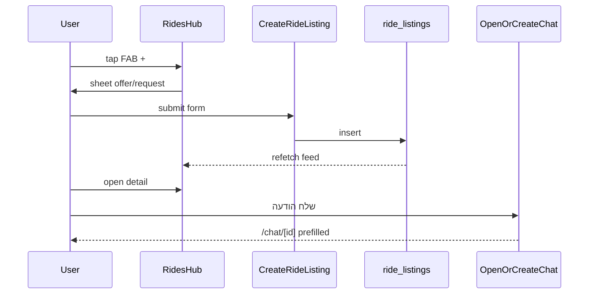

# Rides World V2.0 — Hitchhiking (Minimal Product)

> **Status:** Approved (PM, 2026-05-26)
> **Vision source:** `PRD_V2_NOT_FOR_MVP/donation_worlds/06_Rides.md` (full world — deferred features listed in §8)
> **Success criterion:** More convenient and efficient than WhatsApp / Facebook hitchhiking groups for the core loop (structured publish → discover → chat).
> **Spec targets (to be created):** `docs/SSOT/spec/15_rides.md` — `FR-RIDE-*` (not in SSOT yet; this design precedes SSOT authoring)
> **Scope class:** New vertical module — dedicated entity + UI feature package + chat anchor extension
> **Implementation plan:** Invoke `writing-plans` after PM reviews this document

---

## 1. Goal

Ship a **native hitchhiking product** under **Donations → טרמפים**, replacing the “links-only” experience for day-to-day ride coordination while keeping NGO curated links accessible.

V2.0 optimizes the pain points of group chats:

| Group-chat pain | V2.0 answer |
|-----------------|-------------|
| Unstructured posts | Fixed fields: origin city, destination city, departure time, mode (offer/request) |
| Posts buried in feed | Chronological ride feed + filters + free-text search (Search-tab pattern) |
| “I’m in” comment chaos | One-tap **open chat** anchored on the ride (same pattern as items `contactPoster`) |
| No stable card title | Auto-generated Hebrew title from route + time |

**Non-goal for V2.0:** Beat BlaBlaCar on routing, payments, or safety automation. Beat **groups** on structure and findability.

---

## 2. Product decisions (locked)

| Topic | Decision |
|-------|----------|
| Audience | All authenticated users may **publish** (offer or request) and **contact** any open listing |
| Trust (V2.0) | Existing **user report** flow (`FR-MOD-*`); no blue-check / license gates yet |
| Modes | **Offer** (מציע נסיעה) and **Request** (מחפש נסיעה) — both from day one |
| Entry | Donations Hub → dedicated **טרמפים** tile → Rides Hub screen |
| Publish affordance | **Single FAB `+`** → bottom sheet: choose offer vs request → publish form |
| Coordination | **Direct chat** on tap (like items); no join-approval queue in V2.0 |
| Discovery | **Feed + filter sheet + free-text search** — UX aligned with `/(tabs)/search` (`FR-FEED-016` patterns) |
| Location granularity | **City → city** (reuse `public.cities` picker); no maps / GPS / route overlap % |
| Default origin | Publisher profile `users.city`; user may override per publish |
| Default mode | Last used `offer` \| `request` persisted in AsyncStorage (`rides.lastMode`) |
| Default departure | “Now” (current time, editable) |
| Default seats (offer only) | `3` |
| Title | **System-generated** — user does not type a title |
| Payment | No in-app payment or expense caps enforcement in V2.0; optional free-text in description only |
| Curated NGO links | Preserved as subsection on Rides Hub or linked from former `transport` category — not removed |

---

## 3. Navigation & information architecture

```
Donations Hub (/(tabs)/donations)
└── Tile: טרמפים  →  /(tabs)/donations/rides
        │
        ├── Search bar + filter chips (active filters)
        ├── Ride feed (offers + requests, mixed)
        ├── FAB [+]  →  RideCreateSheet
        │       Step 1: segmented / radio — מציע נסיעה | מחפש נסיעה
        │       Step 2: publish form (fields depend on mode)
        └── Footer section: DonationLinksList categorySlug=transport (optional collapse)
```

**Route convention:** `app/(tabs)/donations/rides/` — `index.tsx` (hub), `[id].tsx` (detail).

**Donations Hub tile:** Add **טרמפים** tile (or retarget existing **תחבורה** tile to `/donations/rides` and move pure link list inside the hub). PM preference from brainstorm: explicit **טרמפים** entry; keep NGO links visible below the native product.

---

## 4. UX specification

### 4.1 Rides Hub

| Element | Behavior |
|---------|----------|
| Search input | 300 ms debounce; query runs at **≥ 2** trimmed characters on `title`, `description`, origin/dest city names |
| Filter sheet | Origin city, destination city, date range (optional), mode filter: offer / request / all, sort: **departure time ascending** (default) |
| Feed card | Auto title, mode badge `[מציע]` / `[מבקש]`, cities, departure datetime (locale formatted), optional description snippet, owner avatar + display name |
| Empty state | When filters active and zero results — clear-filters CTA (mirror feed/search empty patterns) |
| FAB `+` | Opens `RideCreateSheet` (single entry point) |

### 4.2 RideCreateSheet

**Step A — mode (remembered default):**

- `מציע נסיעה` (`offer`)
- `מחפש נסיעה` (`request`)

**Step B — form:**

| Field | Offer | Request | Default |
|-------|-------|---------|---------|
| Origin city | required | required | Profile `users.city` |
| Destination city | required | required | empty |
| Departure date + time | required | required | now |
| Seats available | required (1–8) | hidden | 3 |
| Description | optional ≤ 500 | optional ≤ 500 | empty |

**Submit:** validate → `CreateRideListingUseCase` → dismiss sheet → hub refetch → persist `rides.lastMode`.

**Title generation (display only, server may recompute):**

```text
{originCityName} → {destCityName} · {DD/MM HH:mm}
```

Mode badge rendered in UI, not necessarily embedded in DB title string.

### 4.3 Ride detail

- Full card fields + owner block
- Primary CTA: **שלח הודעה** → `contactRidePublisher` (parallel to `contactPoster`)
- Owner actions: **סגור** (status `closed`) / **בטל** (`cancelled`) — no item-style “mark delivered”
- Report user (existing post/profile report entry points)

### 4.4 Chat integration

- `OpenOrCreateChatUseCase` accepts optional `anchorRideId` (mutually exclusive with `anchorPostId` per call)
- Prefill i18n key: `chat.autoMessage.rideInitial` with ride title
- Chat header shows ride anchor summary (reuse anchored-post chrome pattern; ride-specific subtitle)

---

## 5. Data model

### 5.1 Table `public.ride_listings`

| Column | Type | Notes |
|--------|------|-------|
| `ride_id` | uuid PK | |
| `owner_id` | uuid FK → users | |
| `mode` | text | `offer` \| `request` |
| `origin_city_id` | text FK → cities | |
| `dest_city_id` | text FK → cities | must ≠ origin (check or app validation) |
| `departs_at` | timestamptz | must be ≥ created_at − 15 min slack (app) |
| `seats_available` | int nullable | NOT NULL when mode=offer; NULL when request |
| `description` | text nullable | ≤ 500 |
| `title` | text NOT NULL | generated on insert (trigger or app); max 120 |
| `status` | text | `open` \| `closed` \| `cancelled` |
| `visibility` | text | `Public` \| `FollowersOnly` \| `OnlyMe` — same enum as posts |
| `created_at` / `updated_at` | timestamptz | `set_updated_at` trigger |

**Indexes (MVP):**

- `(status, departs_at)` where `status = 'open'` — hub feed
- `(origin_city_id, dest_city_id)` where `status = 'open'`
- GIN/trigram on `title` + `description` if needed for search (or `ilike` like posts)

### 5.2 Chat anchor

```sql
alter table public.chats
  add column anchor_ride_id uuid null
    references public.ride_listings(ride_id) on delete set null;
```

Constraint: at most one of `anchor_post_id`, `anchor_ride_id` non-null (check constraint).

### 5.3 RLS (high level)

- **SELECT** open `Public` listings: authenticated users (same visibility helper pattern as posts — reuse `is_post_visible_to` logic adapted or shared predicate)
- **INSERT** own rows only
- **UPDATE** owner only; status transitions `open` → `closed`|`cancelled`
- **Admin remove:** future `removed_admin` status optional in V2.1 — not required for V2.0

### 5.4 List / search RPC

`ride_listings_search(p_viewer_id, p_query, p_origin_city, p_dest_city, p_mode, p_from, p_to, p_cursor, p_limit)` — SECURITY DEFINER, visibility-aware, ordered by `departs_at asc`.

---

## 6. Modular architecture

**Principle:** All ride-specific UI lives under `apps/mobile/src/features/rides/`. No ride imports in item post screens. Domain/application/infrastructure each get a `rides/` package slice.

```
packages/domain/src/rides/
  RideListing.ts
  RideMode.ts
  RideStatus.ts
  generateRideTitle.ts
  validateRideDraft.ts          # mode strategies inside

packages/application/src/rides/
  ports/IRideListingRepository.ts
  ports/IRideJoinPolicy.ts        # V2.0: DirectChatJoinPolicy only
  ports/IRideMatchScorer.ts       # V2.0: ChronologicalScorer (no-op route logic)
  CreateRideListingUseCase.ts
  ListRideListingsUseCase.ts
  SearchRideListingsUseCase.ts
  CloseRideListingUseCase.ts
  RideDefaultsService.ts

packages/infrastructure-supabase/src/rides/
  SupabaseRideListingRepository.ts
  mapRideRow.ts

apps/mobile/src/features/rides/
  screens/RidesHubScreen.tsx
  screens/RideDetailScreen.tsx
  sheets/RideCreateSheet.tsx
  sheets/RideFilterSheet.tsx
  components/RideCard.tsx
  store/ridesFilterStore.ts       # mirrors searchStore / filterStore split
  lib/contactRidePublisher.ts
  composition/ridesComposition.ts
```

### 6.1 Extension points (future without breaking V2.0)

| Interface | V2.0 implementation | Future swap |
|-----------|----------------------|-------------|
| `IRideJoinPolicy` | `DirectChatJoinPolicy` | `ApprovalJoinPolicy` + seat ledger table |
| `IRideMatchScorer` | sort by `departs_at` only | `RouteOverlapScorer` (70% / 50% / 90% from PRD) |
| `validateRideDraft` | offer vs request field sets | passenger rules, cargo flags, reimbursement |
| `RideCard` | static props | live status, seat counter, verified badge |

**Rule:** UI never imports `@kc/infrastructure-supabase` — only `ridesComposition.ts` wires use cases.

---

## 7. Core flows



---

## 8. Explicitly out of scope (V2.0)

| Feature (PRD ref) | Deferred to |
|-------------------|-------------|
| Route overlap matching % (§5) | V2.1+ |
| Join approval + seat counter (user liked; start simple) | V2.1 |
| Maps / Waze / live trip status (§2.1.d, §8) | V2.2+ |
| Emergency button (R-Rides-8) | Safety milestone |
| Cross-world cargo / food (§7) | Items/Food integration |
| Expense sharing caps (R-Rides-1/2) | Payments milestone |
| Blue check / license / insurance (R-Rides-3/4, §13) | Verification milestone |
| Recurring rides, multi-stop (§3) | Later |
| Dedicated ride push notifications | Optional V2.1 |
| Item-style closure / recipient / reopen | N/A — rides use `closed`/`cancelled` only |

---

## 9. SSOT & backlog (follow-up, not blocking design)

1. Add `docs/SSOT/spec/15_rides.md` with `FR-RIDE-001`..`FR-RIDE-00N` derived from this doc.
2. Add `P3.x` or `V2.x` row in `docs/SSOT/BACKLOG.md`.
3. Record decision `D-*` in `docs/SSOT/DECISIONS.md`: dedicated `ride_listings` table vs extending `posts`.
4. Update `docs/SSOT/archive/PRD_MVP_CORE_SSOT/08_Out_of_Scope_and_Future.md` timing note when V2.0 ships.

---

## 10. Testing (V2.0)

| Layer | Cases |
|-------|-------|
| Domain | `generateRideTitle`, `validateRideDraft` (offer seats required, request seats null, origin≠dest) |
| Application | `CreateRideListingUseCase` happy + validation errors |
| Infrastructure | repository mapping, search RPC filters (integration with local Supabase) |
| Mobile | RideCreateSheet mode persistence; contact opens chat with `anchorRideId` |

---

## 11. Risks & mitigations

| Risk | Mitigation |
|------|------------|
| Duplicate coordination (chat without seat limits) | V2.1 `ApprovalJoinPolicy`; until then, description can state availability |
| Confusion with items posts | Separate hub, separate table, no feed mixing |
| `transport` donation tile overlap | Single entry to `/donations/rides`; links as subsection |
| Chat anchor proliferation | CHECK one anchor type per chat |

---

## 12. Self-review checklist

- [x] No TBD / placeholder sections
- [x] Consistent with PM approvals (FAB+, modular, chat B, fields D, search C+D, all users publish)
- [x] Scope bounded for one implementation plan
- [x] Extension points documented for future complexity
- [x] English doc; Hebrew UI strings via i18n only

---

*Approved for spec authoring and implementation planning.*
